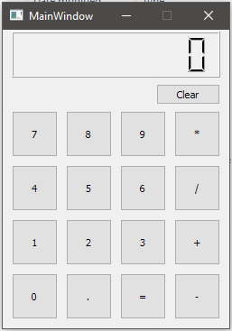

# Qt-Calculator
A small project for HackerSchool's Python workshop.
The commits are organized in a simple way in order to make it easier to follow the process of making the calculator yourself!

Made on Python 3.5 and PyQt 5.6

# Instructions
1. Install [Python 3](https://www.python.org/downloads/)
2. Install PyQt5 (`pip install PyQt5`)
3. Install [QtCreator](https://www.qt.io/download-open-source/)
4. Open QtCreator/QtDesigner and create a UI layout similar to the image above (this step was taught in person during the workshop but it's hard to explain without visual aid. Feel free to follow a tutorial like [this one](https://youtu.be/Dmo8eZG5I2w))
5. Save your layout. You'll get a file with a .ui extension.
6. Open a commandline and run `pyuic5 -x calculator_design.ui -o calculator_design.py` (replace calculator_design with your filename). You should now have a .py file
7. You can now start following [the steps to build a calculator](https://github.com/ric2b/Qt-Calculator/commits/master), from the 3rd commit (*Basic code to show the gui*) onwards :)
8. If you have any feedback or things you'd like to see improved, feel free to [leave an issue](https://github.com/ric2b/Qt-Calculator/issues)! :)
